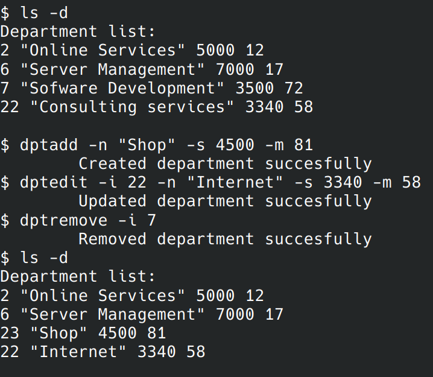

# Business management
> Showcase project built from scratch to demonstrate OOP features for Object Oriented Programming subject in Politechnika Krakowska.

## Table of Contents
* [General Info](#general-information)
* [Technologies Used](#technologies-used)
* [Features](#features)
* [Screenshots](#screenshots)
* [Setup](#setup)
* [Usage](#usage)
* [Project Status](#project-status)
* [Room for Improvement](#room-for-improvement)
* [Acknowledgements](#acknowledgements)
* [Contact](#contact)

## General Information
C++ program designed to showcase the functionality of OOP. It represents a simple business in which there are departments and employees. It has a shell-like command line interface through which the user is able to manage objects and apply business logic to them. It mocks a database by using text files and admits configuration for both database files and help files.

## Functioning
The program is capable of storing and managing employees and the departments in which they work. For each employee, it stores information about it's name, salary, and department. For each department, it stores information about it's name, income, and manager.
The program is able to do various things such as search by name, show employees for a certain department, show manager of a department, etc. It also features some utilities like calculating benefit for each department or for the whole business.

## Features
- Modular file storage.
- Simple, fast database access.
- Complete set of tests for every class and functionality.

## Setup
##### Binary installation
- There is a fully working, pre-compiled executable called business-manager ready to download and run after following next steps.
- You have to create an empty /database directory (or alternatively download the sample database folder from here)
- You have to download the help directory if you want to access the help module.
- You can download standard configuration (.config file). If you do not do this you have to add a path for "employee_file" and "department_file" configuration parameters.

##### Compilation from source code.
- All code needed for compilation is included in primary directory. There are no libraries involved other than *C++ std*.
- There is only need to compile *.cpp* files in primary directory. Other classes are for testing purposes.

##### Compilation with test suite
- Tests are compiled independiently from their own directory.
- Every test depends on *./tests/testConstants.h* to work.
- There are symbolic links to program files to make possible the compilation with one simple command from inside the test directory.
- Tests for EmployeeDAO and DepartmentDAO classes are in the same folder but they should not be compiled together.

## Usage
The program has a CLI to access and modify the database as well as to do business operations and utilities with the elements. The commands are the following:

\- Help

	help [ -c <command> ] # show help

\- Database interaction for employees

	ls -e # list employees
	add -n <name> -s <salary> -d <departmentId> # add employee
	edit -i <id> -n <name> -s <salary> -d <departmentId> # edit employee
	remove -i <id> # remove employee
	find -i <id> # find employee by id
	search -n <name> # search employee by name

\- Database interaction for departments

	ls -d # list departments
	dptadd -n <name> -s <sells> -m <managerId> # add department
	dptedit -i <id> -n <name> -s <sells> -m <managerId># edit department
	dptremove -i <id> # remove department
	dptfind -i <id> # find department by id
	dptsearch -n <name> # search department by name

\- Business methods

	emps -i <departmentId> # show employees of a certain department
	dpt -i <employeeId> # show if employee if manager and managed department if it is
	manager -i <departmentId> # shows manager for a certain department
	benefit [ -i <departmentId> ] # shows benefit for department or for whole business

\- Exit program

	exit # exit the program
	quit # same as exit
	q # same as exit

## Configuration
- Program reads it's configuration from a configuration text file. The location of this file can be specified through the first command line argument while calling the program.
- Default location for configuration file is "./.config".
- Configuration parameters can be specified by a "config_param=config_value" pair in a new line.
- Default location for database files are /database/employee_file.txt and /database/department_file.txt
- Default location for help files is under /help directory. Main help file is called help.txt, and the names of the command help files are like: command_help.txt

## Room for Improvement
- Output parsing responsibility should be moved from Controller class to a new one.
- Common part from Test classes should be abstracted to AbstractTest to avoid code repetition.
- Command and argument interpretation are too strongly tied to CommandReader internal functions, they could be made more modular to avoid work while adding new functions for the program.

#### Technologies Used
- C++20

#### Project Status
Project is complete. Any additions, comments and requests are welcomed in the Issues page, which will be reviewed periodically.

#### Acknowledgements
- This program was created as a final project for Object Oriented Programming subject during Erasmus+ program in Politechnika Krakowsa.
- Responsible teacher for subject: Paweł Król

#### Contact
Created by [@adolfo-trocoli](github.com/adolfo-trocoli)
LinkedIn [profile](https://www.linkedin.com/in/adolfo-trocol%C3%AD-naranjo-a07250224)

## Class diagram
- UML Class diagram with attributes and public methods

## Screenshots
- Example of use of employee management commands

- Example of use of department management commands

- Example of use of business commands

